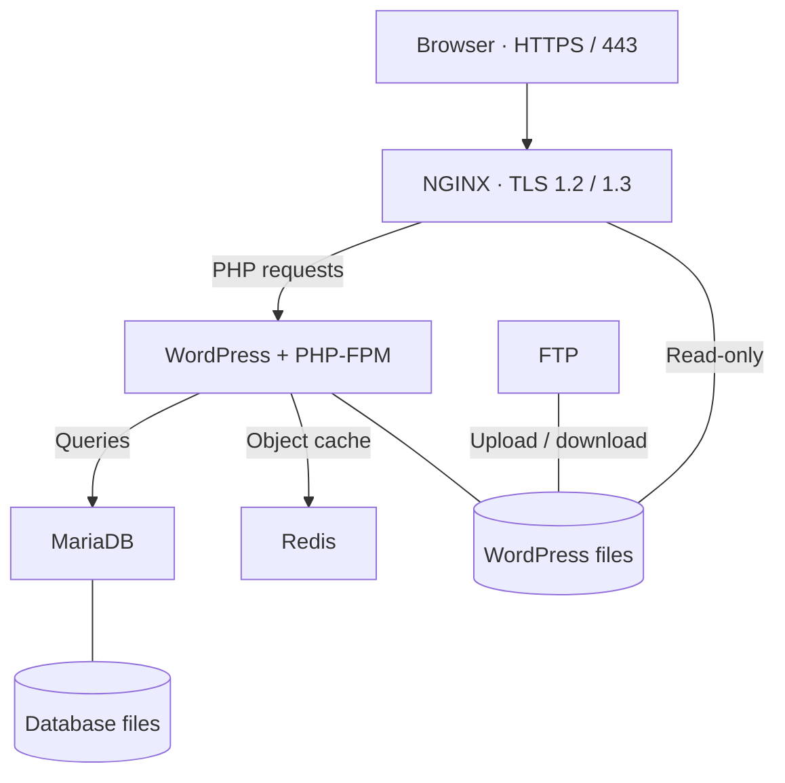

*This project has been created as part of the 42 curriculum by mel-mora.*

<div align="center">

# I N C E P T I O N

**Behind one website, a small infrastructure.**

Custom Docker images · Debian Bookworm · Mandatory + Bonus

[Get started](#instructions) &nbsp; / &nbsp; [User guide](USER_DOC.md) &nbsp; / &nbsp; [Developer guide](DEV_DOC.md)

</div>

---

## Description

This is my Inception project at **1337**. It runs a WordPress website inside a Debian VM, with separate containers for the web server, PHP, and database. Each image is built from a Dockerfile in this repository.

The project covers the parts behind the page: HTTPS, service communication, credentials, persistent storage, and restarting after a crash. The bonus extends it with caching, file transfers, a portfolio, database administration, and monitoring.

> **One command to start:** `make`<br>
> **One place for the source:** `srcs/`<br>
> **Website and database data:** `/home/mel-mora/data/`

## Project description

### The route to WordPress



NGINX serves static WordPress files and forwards PHP requests to PHP-FPM. WordPress talks to MariaDB and uses Redis Object Cache. The services find each other by name on the `inception` bridge network.

The diagram focuses on the website and its storage. NGINX also proxies the portfolio, Adminer, and Monit.

### Three services at the core

| Service | What it owns |
| :--- | :--- |
| **NGINX** | HTTPS, certificates, static files, and routing requests to the right service. |
| **WordPress + PHP-FPM** | The website, its dashboard, and the owner/subscriber accounts created through WP-CLI. |
| **MariaDB** | Posts, users, settings, and the database account used by WordPress. |

### Five additions that have a job

| Bonus | Role in the project | Access |
| :--- | :--- | :--- |
| **Redis** | Cache WordPress objects in memory. | Internal network |
| **FTP / vsftpd** | Upload and download files from the WordPress volume. | Port `21`, passive `21100–21110` |
| **Static portfolio** | A separate HTML/CSS site served by its own NGINX container. | `/portfolio/` |
| **Adminer** | Manage MariaDB from the browser. | `/adminer/` |
| **Monit** | Check whether the service endpoints respond. | HTTPS port `8443` |

I chose **Monit** for the additional service because it gives one view of the stack's availability. It checks endpoints; Docker's restart policy handles unexpected container exits.

### What stays when containers go

Two named volumes store the important data:

| Volume | VM directory | Used by |
| :--- | :--- | :--- |
| `mariadb_data` | `/home/mel-mora/data/mariadb` | MariaDB |
| `wordpress_data` | `/home/mel-mora/data/wordpress` | WordPress, FTP, NGINX (read-only) |

Redis is disposable cache. Its contents can be rebuilt, so it has no persistent volume. The generated TLS certificate and Monit state are container-local.

### Why this setup

All eight images use **`debian:bookworm`**, with packages installed through their own Dockerfiles. Services run in the foreground, startup scripts use `exec` to launch the main process, and Compose applies `restart: unless-stopped`.

The main website uses **443**. Bonus access adds **8443** and the FTP ports. Database, PHP-FPM, Redis, Adminer, and portfolio ports are not published directly to the host.

<details>
<summary><strong>VMs, secrets, networks, volumes — the design choices</strong></summary>

<br>

| Comparison | Difference and choice here |
| :--- | :--- |
| **Virtual machines vs Docker** | A VM runs its own guest kernel. Containers share their host's kernel while isolating processes. This project uses a Debian VM with Docker containers inside it. |
| **Secrets vs environment variables** | Environment variables carry settings such as domain names and usernames. Compose secrets mount selected local files inside containers. Passwords are read from `/run/secrets`; `.env` and `secrets/` are ignored by Git. The local files still need protection. |
| **Docker network vs host network** | A bridge network gives containers their own network space and service-name lookup. Host networking shares the host network directly. This project uses a bridge and publishes only the needed ports. |
| **Docker volumes vs bind mounts** | A named volume is a Docker storage object; a direct bind mount maps a host path into a container. Services here reference named volumes whose local driver uses bind options to store data in the required VM directories. |

</details>

---

## Instructions

### 01 · Prepare

Use a Linux VM with **Docker Engine**, modern **Docker Compose**, **Git**, **Make**, and **OpenSSL**. Builds and first-time WordPress setup need internet access.

```bash
git clone https://github.com/MohamedMorabet/42-Inception.git ~/inception
cd ~/inception
```

Follow [DEV_DOC.md — Fresh setup](DEV_DOC.md#fresh-setup) to create `srcs/.env`, the six password files in `secrets/`, and a hosts entry mapping `mel-mora.42.fr` to the VM's reachable IP on your browsing device.

### 02 · Launch

```bash
make
make ps
```

The current Compose configuration starts **mandatory and bonus services together**. On first launch, WordPress installs the site, creates the accounts, and enables its Redis plugin.

### 03 · Open

| Destination | Address |
| :--- | :--- |
| **Website** | [mel-mora.42.fr](https://mel-mora.42.fr/) |
| **WordPress dashboard** | [mel-mora.42.fr/wp-admin/](https://mel-mora.42.fr/wp-admin/) |
| **Portfolio** | [mel-mora.42.fr/portfolio/](https://mel-mora.42.fr/portfolio/) |
| **Adminer** | [mel-mora.42.fr/adminer/](https://mel-mora.42.fr/adminer/) |
| **Monitoring** | [mel-mora.42.fr:8443](https://mel-mora.42.fr:8443/) |

These addresses work after local domain mapping. HTTPS uses a self-signed certificate, so the browser initially displays a warning. FTP uses plain FTP in passive mode on the trusted project network.

### Keep these commands close

```bash
make         # Build and start
make ps      # Container status
make logs    # Recent logs
make down    # Stop and remove containers
make build   # Build images
make re      # Remove Docker resources, rebuild, and start
```

**Data survives `make down` and `make re`.** Even `make fclean` removes the named volume objects without deleting their backing directories under `/home/mel-mora/data`. A Git clone does not restore those directories, your passwords, or your `.env`.

---

## Inside the repository

| Path | Contents |
| :--- | :--- |
| `Makefile` | Commands for the stack |
| `srcs/docker-compose.yml` | Services, network, ports, volumes, and secret mappings |
| `srcs/requirements/mariadb/` | Database image, settings, and initialization script |
| `srcs/requirements/wordpress/` | PHP-FPM settings and WordPress setup |
| `srcs/requirements/nginx/` | HTTPS routing and certificate generation |
| `srcs/requirements/bonus/` | Redis, FTP, static-site, Adminer, and Monit |

Dockerfiles install the software. `conf/` files configure it, and `tools/` scripts prepare services at startup where needed. The portfolio source is included under `bonus/static-site/html/`. WP-CLI is installed during the WordPress image build; WordPress and the Redis plugin are downloaded at startup when missing.

| Need to… | Read |
| :--- | :--- |
| Use the services, find credentials, or check their status | **[USER_DOC.md](USER_DOC.md)** |
| Install from scratch, rebuild a service, or manage data | **[DEV_DOC.md](DEV_DOC.md)** |

## Resources

[Docker](https://docs.docker.com/) · [NGINX](https://nginx.org/en/docs/) · [MariaDB](https://mariadb.com/docs/) · [PHP-FPM](https://www.php.net/manual/en/install.fpm.php)

[WP-CLI](https://make.wordpress.org/cli/handbook/) · [Redis Object Cache](https://wordpress.org/plugins/redis-cache/) · [vsftpd](https://security.appspot.com/vsftpd.html) · [Adminer](https://www.adminer.org/) · [Monit](https://mmonit.com/monit/documentation/monit.html)

### AI use

I used ChatGPT to help draft Dockerfiles, startup scripts, service configurations, test commands, and documentation. It also helped troubleshoot build and connection errors while I ran the project in my VM. I am responsible for checking the resulting code and explaining how the setup works during evaluation.

---

<div align="center">

**mel-mora** · 1337 / 42 Network<br>
[GitHub](https://github.com/MohamedMorabet)

</div>
