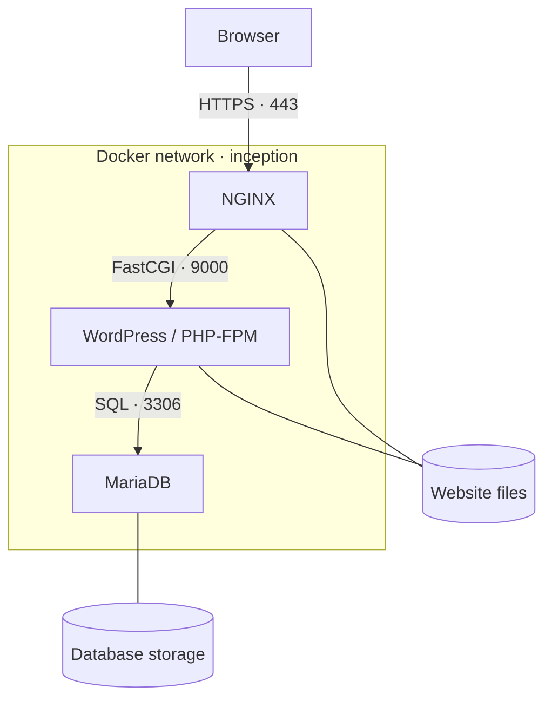

*This project has been created as part of the 42 curriculum by mel-mora.*

<div align="center">

# INCEPTION

### Three services. One entry point. Persistent state.

A containerized WordPress infrastructure built from Debian-based images.

`42 / 1337` · `Docker Compose` · `NGINX` · `PHP-FPM` · `MariaDB`

[Description](#description) · [Architecture](#architecture) · [Instructions](#instructions) · [Design choices](#design-choices) · [Resources](#resources)

</div>

---

## Description

Inception is a system administration project that builds a small web infrastructure inside a virtual machine. Its purpose is to make the relationship between networking, application processes, configuration, and persistent storage explicit.

The stack runs **NGINX**, **WordPress with PHP-FPM**, and **MariaDB** in separate containers. Each service has its own Dockerfile, and Docker Compose defines how the services work together. A root-level Makefile builds and starts the application.

The website is available at **https://mel-mora.42.fr**. NGINX is the public entry point; PHP execution and database access happen within the container network.

This README covers the three-service mandatory stack.

## Architecture



| Service | Responsibility | Host access |
| --- | --- | --- |
| `nginx` | Terminates TLS, serves static files, and forwards PHP requests to PHP-FPM | HTTPS on port `443` |
| `wordpress` | Runs WordPress through PHP-FPM; uses WP-CLI for administration | Through NGINX |
| `mariadb` | Stores WordPress content, users, settings, and metadata | Through the internal network |

Website files and database data have separate persistent storage. Replacing a container should not erase either one.

## Project description

### Docker and project sources

The service images are built locally from `debian:bookworm`. The project installs and configures the required software in its own Dockerfiles instead of deploying prebuilt NGINX, WordPress, or MariaDB application images.

| Source | Purpose |
| --- | --- |
| `Makefile` | Creates data directories and orchestrates the stack |
| `srcs/docker-compose.yml` | Declares service builds, networking, storage, environment, secrets, and restart behavior |
| `srcs/.env` | Supplies deployment configuration |
| `srcs/requirements/nginx/` | NGINX Dockerfile, server configuration, and startup script |
| `srcs/requirements/wordpress/` | WordPress Dockerfile, PHP-FPM configuration, and initialization script |
| `srcs/requirements/mariadb/` | MariaDB Dockerfile, server configuration, and initialization script |

Secret source files are local deployment inputs. Their exact paths are declared in the Compose file and must be provisioned before startup.

### Design choices

**Separate responsibilities.** NGINX handles incoming web traffic, PHP-FPM executes the application, and MariaDB stores its data. Each service can be inspected or restarted independently.

**A single public entry point.** The intended external interface is HTTPS on port `443`, with TLS 1.2 or TLS 1.3. Application and database ports remain internal.

**Configuration outside image builds.** Deployment values belong in environment configuration, while passwords are supplied through secret files. Credentials must not be embedded in Dockerfiles or committed to Git.

**State outside container lifetimes.** Website and database storage live under `/home/mel-mora/data`. Normal shutdown and recreation preserve this data.

### Required comparisons

| Comparison | How they differ | Choice in this project |
| --- | --- | --- |
| **Virtual Machines vs Docker** | A VM runs its own guest kernel. Containers isolate processes while sharing the Docker host's kernel, using less overhead than a separate VM per service. | A VM hosts Docker; individual containers run the services. |
| **Secrets vs Environment Variables** | Environment variables suit ordinary configuration but may appear in process inspection or diagnostic output. Compose secrets expose selected values as files to explicitly authorized services. Local secret source files still need protection. | Use `.env` for configuration and secrets for confidential values. |
| **Docker Network vs Host Network** | A user-defined bridge network separates container networking and supports service-name discovery. Host networking shares the host network namespace. | A dedicated Docker network connects the services; only NGINX publishes a host port. |
| **Docker Volumes vs Bind Mounts** | Named volumes are Docker-managed storage objects. Bind mounts directly attach a specified host path to a container. Named volumes can also use driver options to select backing storage. | The subject requires two named volumes with data under `/home/mel-mora/data`; direct service-level bind mounts are not the required storage model. |

## Instructions

Run the following commands from the repository root inside the project VM.

### 1. Prepare the environment

You need a Linux VM, Docker Engine, Docker Compose v2, GNU Make, and permission to use Docker. Internet access is needed for the initial build and downloads.

```bash
docker --version
docker compose version
make --version
```

Before building:

1. Create `srcs/.env` with all configuration values referenced by the Compose file and startup scripts, including the domain, database identity, and WordPress account settings.
2. Create every secret source file declared in `srcs/docker-compose.yml`, using private passwords.
3. Keep credential-bearing files out of Git and restrict access to them.
4. Ensure the VM user can create and use `/home/mel-mora/data/mariadb` and `/home/mel-mora/data/wordpress`.

The configured WordPress accounts are `mel-mora` as administrator and `reader` as subscriber. Passwords are supplied locally and are intentionally absent from this documentation.

### 2. Configure domain resolution

On the machine running the browser, map `mel-mora.42.fr` to the VM's reachable IP address using local DNS or its hosts file. If the browser runs inside the VM, `127.0.0.1` can be used.

Hosts-file changes require administrator access. On a restricted campus workstation, the `curl --resolve` check below can test the site without changing system configuration.

### 3. Build and launch

```bash
make
```

The default target creates the data directories and runs Docker Compose with a build in detached mode.

| Destination | URL |
| --- | --- |
| Website | https://mel-mora.42.fr |
| Administration | https://mel-mora.42.fr/wp-admin/ |

The local self-signed certificate may trigger a browser trust warning. It encrypts traffic but is not automatically trusted by the browser.

### 4. Inspect and stop

```bash
# Show service status
docker compose -f srcs/docker-compose.yml ps

# Read recent logs
docker compose -f srcs/docker-compose.yml logs --tail=50

# Stop and remove the stack's containers and network
make down

# Build and start again
make
```

`make down` preserves persistent data. Deleting data directories or invoking a destructive cleanup is a separate operation and should only be done when a full reset is intended.

## Verification

### HTTPS response

Inside the VM:

```bash
curl -k --resolve mel-mora.42.fr:443:127.0.0.1 \
    -I https://mel-mora.42.fr/
```

When testing from another machine, replace `127.0.0.1` with the VM's reachable IP address. The `-k` flag bypasses certificate verification for this local test only.

### WordPress accounts

```bash
docker compose -f srcs/docker-compose.yml exec wordpress \
    wp user list --allow-root --fields=ID,user_login,roles
```

### Persistent data

Create a draft post or upload a file, run `make down` followed by `make`, and verify that the content remains available.

During development, both a database option and a file under `/var/www/html` survived container removal and recreation. Crash-recovery checks also showed all three services returning to a running state with an increased restart count. These checks document observed behavior; they are not a substitute for the full subject evaluation.

## Resources

- [Docker Compose documentation](https://docs.docker.com/compose/) — service definitions and stack lifecycle.
- [Docker Compose secrets](https://docs.docker.com/compose/how-tos/use-secrets/) — per-service access to secret files.
- [Docker volumes](https://docs.docker.com/engine/storage/volumes/) — persistent storage and volume management.
- [NGINX FastCGI module](https://nginx.org/en/docs/http/ngx_http_fastcgi_module.html) — forwarding PHP requests to PHP-FPM.
- [WP-CLI command reference](https://developer.wordpress.org/cli/commands/) — WordPress installation and administration commands.
- [MariaDB Server documentation](https://mariadb.com/docs/server) — database configuration and operation.
- Inception subject, version 5.4 — project constraints and documentation requirements.

### Use of AI

ChatGPT assisted with step-by-step implementation guidance for the MariaDB, WordPress/PHP-FPM, and NGINX services; Docker Compose and Makefile setup; troubleshooting from terminal output; verification commands for connectivity, persistence, and restart behavior; and drafting this README.

Commands were executed in the project VM and their output was used to refine the setup. AI assistance does not replace reviewing the source, understanding the service lifecycle, or demonstrating the implementation during peer evaluation.

---

<div align="center">

**Mohamed El-Morabet** · `mel-mora` · 1337 / 42 Network

</div>
